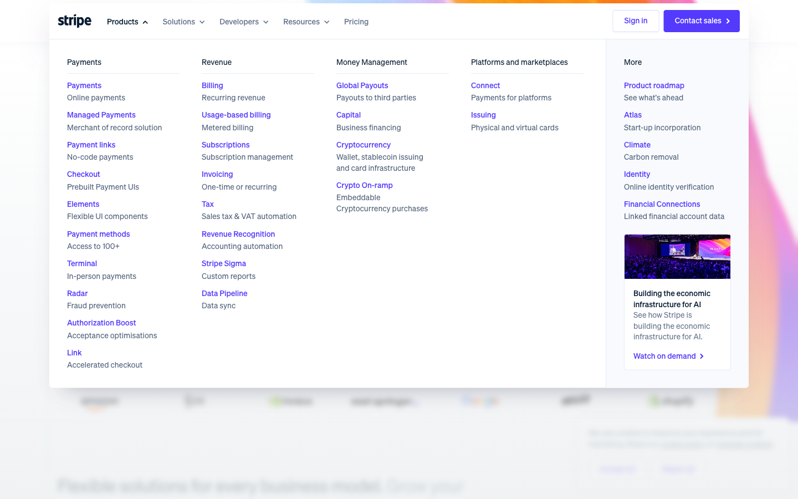
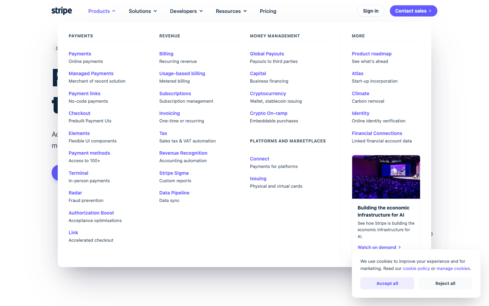

# Autonomous UI Replication Agent: Technical Design Document

## Scope & Current Implementation (Proof of Concept)
To validate the theoretical architecture outlined in this document, I developed a focused Proof of Concept (PoC) targeting the industry gold standard for complex frontend interactions: Stripe.

Specifically, this PoC isolates and replicates the Stripe "Products" mega-menu dropdown.

Given the constraints of the assignment, the current codebase serves as an architectural validation rather than a fully converged, production-ready system. The implementation successfully proves that the core mechanics—the sandboxed REPL extraction, the generation pipeline, and the test symmetry evaluation—fundamentally work.

However, the loop is not currently run to absolute, pixel-perfect convergence. It is a functional blueprint demonstrating how the problem is solved, but it will require further engineering polish, robust edge-case handling, and extended iteration budgets to reach a final, commercial state.


## Abstract

This document outlines the architecture for an autonomous agent capable of observing a live web UI and replicating its visual styling, layout, and interaction mechanics.

To prevent the hallucination spirals common in generative UI tasks, this system discards the traditional "dump the DOM into the prompt" approach. Instead, it utilizes a strictly bounded 3-Phase Actor-Critic Pipeline (`Observe`, `Generate`, `Evaluate`). It relies on a sandboxed REPL environment for deterministic data extraction and enforces Test Symmetry to mathematically and visually grade the generated React components.

## 1. Tool Design

My design philosophy relies on a strictly minimal, purpose-built toolset. The Generate Agent is intentionally denied access to a raw headless browser or unrestricted terminal.

### The Sandboxed Context REPL (PythonREPLTool)

- Function: A locked-down Python execution environment pre-injected with grep(filepath, pattern) and read_slice() helper functions. It includes a guardrail that throws a hard error if stdout exceeds 10,000 characters.

- Usage: Generate & Refine stages.

- Trade-off: Building robust semantic querying APIs for arbitrary DOMs is brittle, so V1 pushes the extraction logic onto the LLM using basic grep. However, parsing HTML with regex is inherently limited. V2 Roadmap: Expose BeautifulSoup (bs4) directly within this REPL sandbox alongside grep. This will allow the generation agent to execute semantic, tree-based queries (e.g., soup.find('button').parent) to better understand the DOM hierarchy without flooding its context window.

### The Targeted Diff Engine (`BeautifulSoup + difflib`)

- Function: Accepts an original DOM dump, a generated DOM dump, and a target CSS selector such as `header nav`. It parses both trees, extracts the target nodes, and returns a truncated, standard unified text diff.
- Usage: Evaluate stage.
- Trade-off: Full visual-tree differencing is computationally expensive. Text diffing is fast and LLMs understand unified diffs natively. To mitigate text-diff noise such as dynamic React IDs, `BeautifulSoup` is used to surgically isolate nodes before diffing.

### The Multimodal Vision Judge (Native VLM API)

- Function: Takes three pairs of image states, original vs generated for `Pre`, `Hover`, and `Post`, alongside the output of the Diff Engine. It returns a coerced JSON payload:

```json
{"status": "PASS" | "FAIL", "refinement_pointers": [...]}
```

- Usage: Evaluate stage.

## 2. Extraction Strategy

The extraction strategy is built on a DOM-Visual Hybrid Architecture, decoupling the visual state from the mathematical state to capture high-fidelity interactions without overwhelming the agent.

### Categories Collected

- Structural DOM (The Skeleton): Raw `outerHTML` snippets to map semantic structure and SVG paths.
- Computed Styles (The Math): Serialized `window.getComputedStyle` JSON dumps for target nodes, capturing exact hex colors, typography, and box-model geometry.
- Visual State (The Pixels): Discrete, high-resolution screenshots of the UI state machine (`Pre-Hover`, `Hover`, `Post-Hover`).
  - V2 Roadmap: Native Playwright video traces.

### Prioritization: Eager Capture, Lazy Query

Playwright records visual states and dumps DOM/CSS files upfront to guarantee state consistency. The Generate Agent does not ingest these files immediately. Instead, it lazily queries the local dumps using its `grep` REPL tool to extract only what it needs while writing code.

### Handling Modern Web Realities

By extracting computed styles rather than raw stylesheets, the agent bypasses the obfuscation of Tailwind utility classes and CSS-in-JS.

### Filtering Incidental Noise (Deferred Resolution)

Rather than trying to parse out noise during the raw extraction phase, the system captures the complete DOM to preserve global context. The actual separation of "intentional design" versus "incidental noise" is deferred to the Evaluation phase. There, the system uses Scoped Targeting (BeautifulSoup) and State Differencing (difflib) to mathematically strip away static background elements and dynamic React IDs, forcing the agent to focus strictly on the mutated nodes.

## 3. Generation Approach

The agent acts as an autonomous investigator that queries its environment before writing code.

### Prompt Structure

1. Hypothesis: Review the visual ground truth and hypothesize the interaction mechanics.
2. Investigation: Query the local asset dumps using the REPL to extract exact CSS values.
3. Generation: Write the complete React/Tailwind component in a single pass.

### Preventing Hallucinations

LLMs naturally want to guess Tailwind classes. The sandboxed REPL interceptor prevents the model from reading entire HTML files, forcing it to use the surgical `grep` tool to extract the actual mathematical truth rather than inventing it.

V2 Roadmap (Semantic Investigation): Currently, the agent relies strictly on flat grep string matching to investigate the DOM before writing code. In future iterations, providing the agent with BeautifulSoup access inside the Generate phase's REPL will allow it to autonomously parse the DOM tree, calculate element depths, and extract specific node clusters, vastly improving the structural accuracy of its generated React components.

### Iterative Memory (Refine Mode)

If a QA feedback payload (`feedback_loop.txt`) exists from a previous iteration, the agent shifts from "Creator" to a "Senior Developer addressing a PR." It retains REPL access, allowing it to autonomously debug why it failed by re-querying the original assets before rewriting the code.

## 4. Evaluation Mechanism

Without a rigorous critique, generation loops spiral. This system enforces an Actor-Critic Pipeline built on Test Symmetry, meaning the evaluation strictly mirrors the state machine observed during extraction.

### What Is Measured

- Deterministic DOM Structure (The Math): The Root Evaluator runs a unified diff to measure if structural changes, for example injecting a dropdown node, actually occurred in the generated code.
- Multimodal Visual Symmetry (The Pixels): A Vision LLM evaluates the UI states for alignment, typography, and correct state transitions.

### Actionable Feedback

The Root Evaluator synthesizes the HTML diffs and visual discrepancies into a strict JSON payload. Instead of a vague "looks wrong," the agent receives specific pointers such as:

```json
{
  "refinement_pointers": [
    "Visual Fail: The dropdown modal intersects the header. Add 'absolute top-full'."
  ]
}
```

### Avoiding Evaluation Drift

The agent never compares Iteration 2 against Iteration 1. Every evaluation forces a strict comparison of the current generated UI directly against the Original Baseline Assets. Deterministic DOM checks take precedence over LLM visual opinions.

## 5. Convergence and Failure Handling

Agents are not magic; they are bounded workers operating on a strict budget.

### Stopping Criterion

The loop terminates when the Root Evaluator detects zero deterministic DOM errors and the Vision LLM returns `"status": "PASS"` across all interaction states.

### Budget Strategy

Fast, deterministic failure is prioritized over expensive hallucination. The loop is strictly capped at `MAX_ITERATIONS = 3`.

### V2 Roadmap: Degradation, Recovery, and Shared Memory

- Shared Agentic Memory (Anti-Oscillation): In future iterations, I would implement an iteration_history.json ledger. If the agent tries to apply a CSS structure that was already flagged as a failure in Iteration 1, the orchestrator would read this shared memory, detect the repeated pattern, and inject a hard prompt constraint to force the agent out of its local minima.

- State Checkpointing: Tracking errors per iteration to execute git-style rollbacks if Iteration 3 yields more visual errors than Iteration 2.

## System Architecture Flows

### Agent Control Flow

```text
Start: Observe Phase
  -> Load Ground Truth Assets
  -> Is there a feedback file?
     -> No:
        -> Iteration 0 Prompt: Query DOM and Write Code
        -> Output: GeneratedMegaMenu.jsx
     -> Yes:
        -> Refine Prompt: Read Feedback and Fix Code
        -> Output: GeneratedMegaMenu.jsx

GeneratedMegaMenu.jsx
  -> Deterministic Check: difflib HTML Diff
  -> Visual Check: Vision LLM Symmetry
  -> Did both checks pass?
     -> Yes:
        -> Success: Loop Converged
     -> No:
        -> Iteration limit exceeded?
           -> Yes:
              -> Abort: Max Budget Reached
           -> No:
              -> Generate specific feedback_loop.txt
              -> Trigger next iteration
```

## Hover State Comparison

Screenshots for reference

| Original Hover State | Generated Hover State |
| --- | --- |
|  |  |
